<div align="center">

# 📱 Recurrly

### Your subscriptions. Finally under control.

A modern React Native + Expo mobile application that helps people track, organize, and understand their recurring subscriptions — with real authentication, a hand-built analytics engine, and a fully theemable, native-feeling UI.

<br/>


<br/>

**[📲 Install the Android Build](#-install-the-android-app)** · **[🏗️ Architecture](#️-architecture)** · **[⚡ Getting Started](#-getting-started)**

</div>

<br/>

<div align="center">

<table>
<tr>
<td>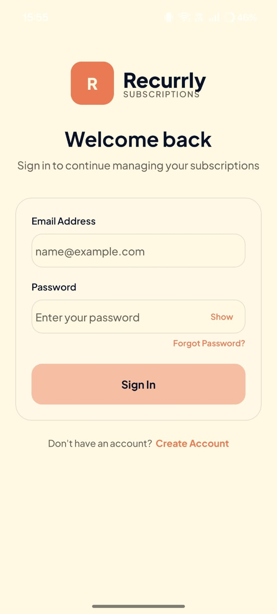</td>
<td>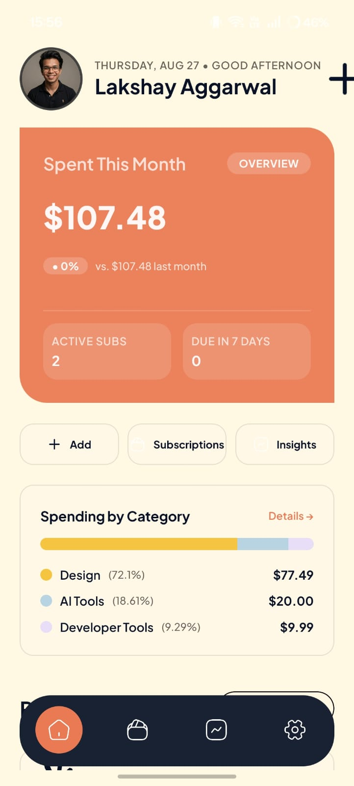</td>
<td>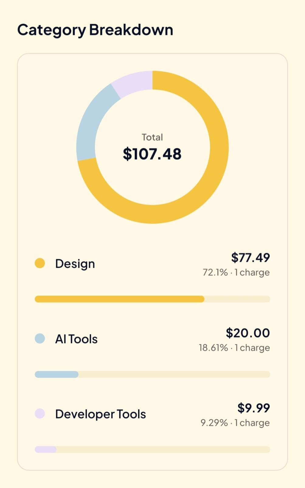</td>
<td>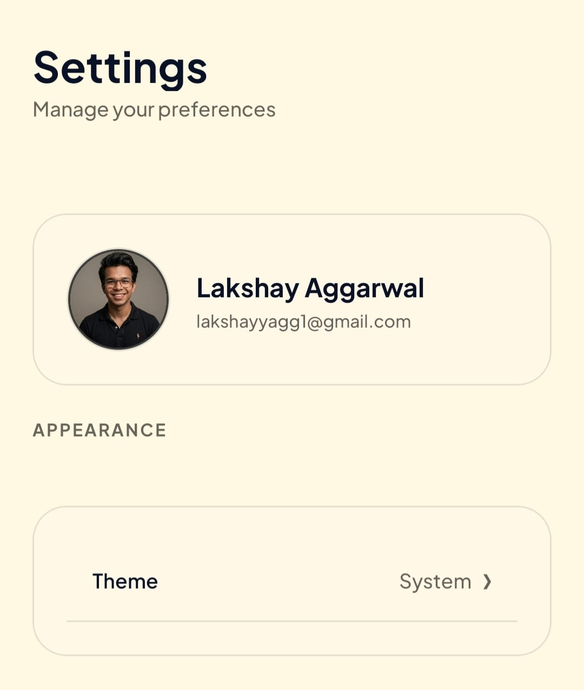</td>
</tr>
</table>

*Real screenshots, straight from the running app — no mockups.*

</div>

<br/>

---

## ✨ Why Recurrly?

Subscriptions have quietly become one of the easiest ways to lose track of your money — a few dollars here for a streaming service, a few more there for a design tool, and suddenly nobody remembers what's actually being paid for.

**Recurrly** was built to solve that problem directly on your phone: one clean home screen that shows what's active, what's renewing soon, and where the money is actually going — backed by a purpose-built insights engine that turns raw subscription data into a monthly spending story, a financial health score, and plain-language observations.

This project was built as a hands-on deep dive into **production-grade React Native development** — file-based routing, real third-party authentication, custom-built data visualization (no charting libraries), theming architecture, and cloud-based Android builds via EAS.

---

## 🚀 Features

<table>
<tr>
<td width="50%" valign="top">

### 🔐 Secure Authentication
Full email/password sign-up and sign-in flow powered by **Clerk**, including email verification via one-time codes, a forgot-password recovery flow, and encrypted session token storage on-device via `expo-secure-store`.

</td>
<td width="50%" valign="top">

### 💳 Subscription Management
Add, browse, and search subscriptions with category tagging, billing frequency (monthly/yearly), payment method labels, and live client-side form validation.

</td>
</tr>
<tr>
<td width="50%" valign="top">

### 📊 Financial Insights Engine
A dedicated **billing ledger** projects historical and upcoming charges, powering a monthly spending overview, category breakdown, and a 6-month spending trend — all computed locally, no backend required.

</td>
<td width="50%" valign="top">

### 🩺 Financial Health Score
A custom scoring algorithm evaluates spending patterns and renders an animated circular score gauge with plain-language factors explaining what's helping or hurting the score.

</td>
</tr>
<tr>
<td width="50%" valign="top">

### 🔔 Upcoming Renewals
The Home dashboard automatically surfaces subscriptions renewing within the next 7 days, sorted by urgency, so nothing renews as a surprise.

</td>
<td width="50%" valign="top">

### 🌙 Light / Dark / System Theming
A full theming system built on React Context, with a persisted user preference (light, dark, or follow-system) stored securely on-device.

</td>
</tr>
<tr>
<td width="50%" valign="top">

### 💡 Smart Insights
A lightweight rules engine generates human-readable observations and recommendations (e.g. spending spikes, category concentration) from the current month's data.

</td>
<td width="50%" valign="top">

### ⚙️ Personalization & Settings
Currency selection (USD / INR / EUR / GBP), haptic feedback toggle, reminder preferences, and account details — all in a polished bottom-sheet settings experience.

</td>
</tr>
</table>

### 📈 Custom-Built Data Visualization

Every chart in Recurrly — the animated category **donut chart** and the monthly **trend bar chart** — is hand-built with `react-native-svg` and `Animated`, rather than a third-party charting library. This was a deliberate choice to fully control animation timing, styling, and native performance.

---

## 📱 Explore the App

A guided tour through Recurrly, in the exact order a real user experiences it — from first launch to managing subscriptions and reviewing spending. Every image below is an **actual screenshot** of the running app.

<br/>

### 🌟 Welcome Experience

The first screen shown to a signed-out user — before any account exists, before any data is entered.

<div align="center">
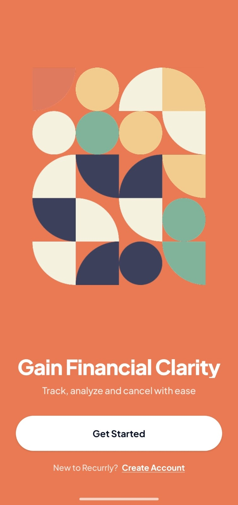
</div>

<p align="center"><i>"Gain Financial Clarity" — the welcome screen introduces Recurrly's purpose and routes into Sign In or Create Account.</i></p>

<br/>

### 🔐 Authentication

Real Clerk-powered sign in and sign up, matching the app's warm cream/navy/coral visual identity.

<table>
<tr>
<td align="center" width="50%">
<br/>
<b>Sign In</b><br/>
<sub>Email + password sign-in with a "Forgot Password?" recovery link.</sub>
</td>
<td align="center" width="50%">
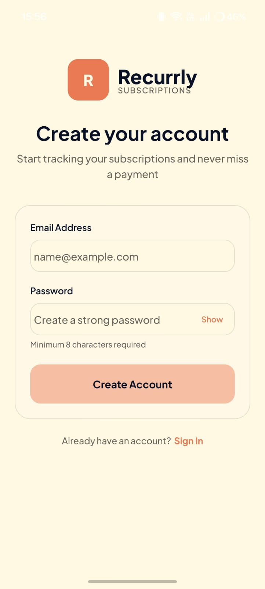<br/>
<b>Sign Up</b><br/>
<sub>Account creation with live password requirements, backed by Clerk email verification.</sub>
</td>
</tr>
</table>

<br/>

### 🏠 Home Experience

Your financial overview at a glance — this month's spend, what's due soon, and where the money is going.

<table>
<tr>
<td align="center" width="33%">
<br/>
<b>Dashboard Overview</b><br/>
<sub>Greeting, monthly spend hero card, active subscription count, quick actions, and a spending-by-category preview.</sub>
</td>
<td align="center" width="33%">
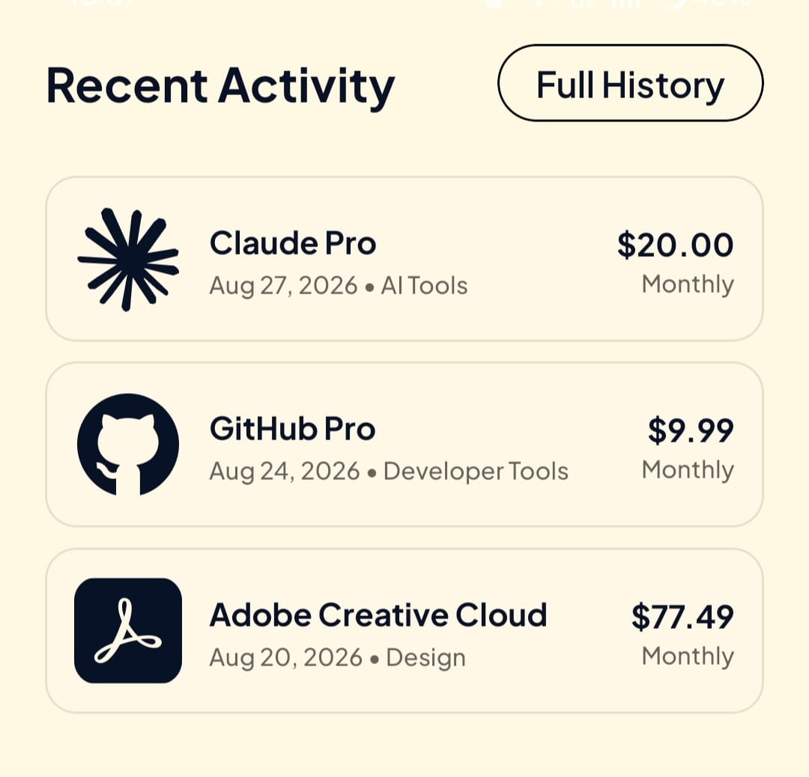<br/>
<b>Recent Activity</b><br/>
<sub>Scrolling down surfaces the latest billing activity — subscription, date, and category at a glance.</sub>
</td>
<td align="center" width="33%">
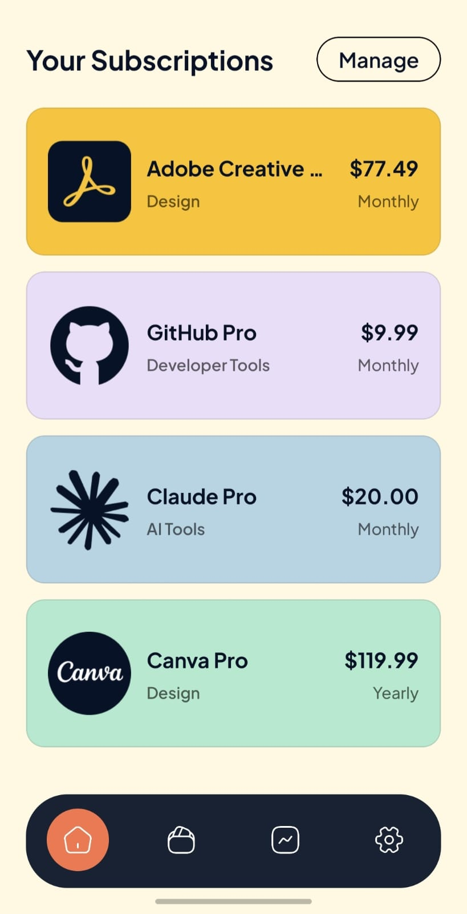<br/>
<b>Your Subscriptions</b><br/>
<sub>A color-coded preview of active subscriptions, with a "Manage" shortcut into the full Subscriptions tab.</sub>
</td>
</tr>
</table>

<br/>

### 💳 Subscription Management

<div align="center">
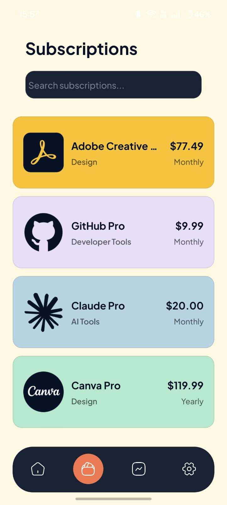
</div>

<p align="center"><b>Stay on Top of Every Subscription</b><br/><sub>The full Subscriptions tab — searchable, color-coded cards showing each service's plan, category, price, and billing frequency.</sub></p>

<br/>

### 📊 Insights & Analytics

The financial-insights engine, end to end — from monthly totals down to a plain-language reading of your spending health.

<table>
<tr>
<td align="center" width="50%">
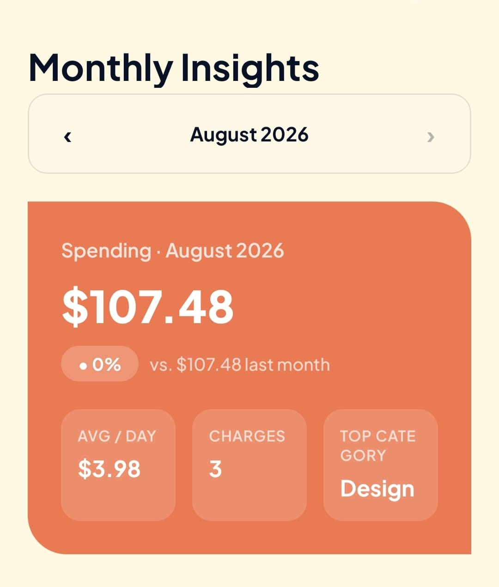<br/>
<b>Monthly Overview</b><br/>
<sub>Month switcher plus total spend, average per day, number of charges, and top category for the selected month.</sub>
</td>
<td align="center" width="50%">
<br/>
<b>Category Breakdown</b><br/>
<sub>The hand-built animated donut chart, with a per-category list showing amount, share of spend, and charge count.</sub>
</td>
</tr>
<tr>
<td align="center" width="50%">
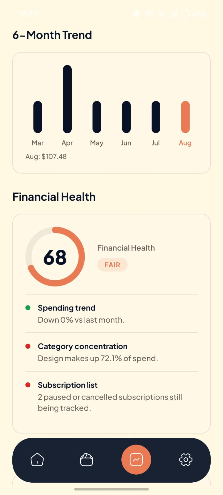<br/>
<b>Trend & Financial Health</b><br/>
<sub>A 6-month spending trend chart, paired with an animated Financial Health score and the factors behind it.</sub>
</td>
<td align="center" width="50%">
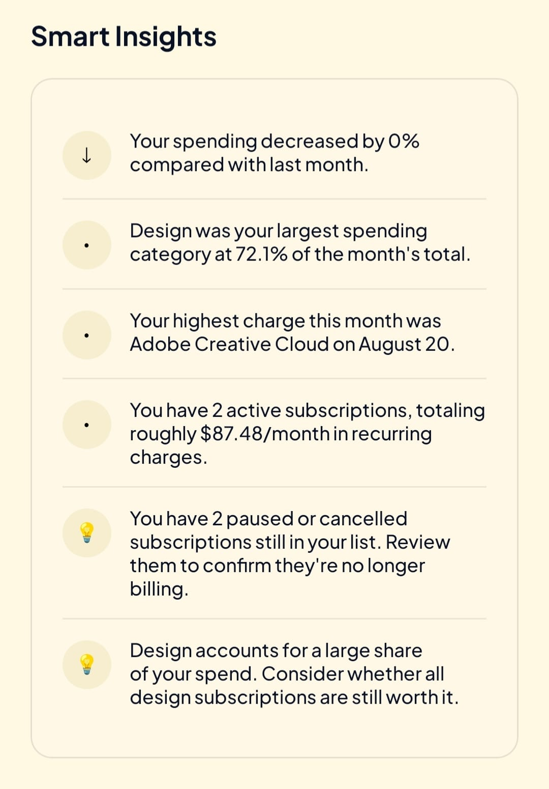<br/>
<b>Smart Insights</b><br/>
<sub>Plain-language observations and recommendations generated from the current month's data.</sub>
</td>
</tr>
</table>

<div align="center">
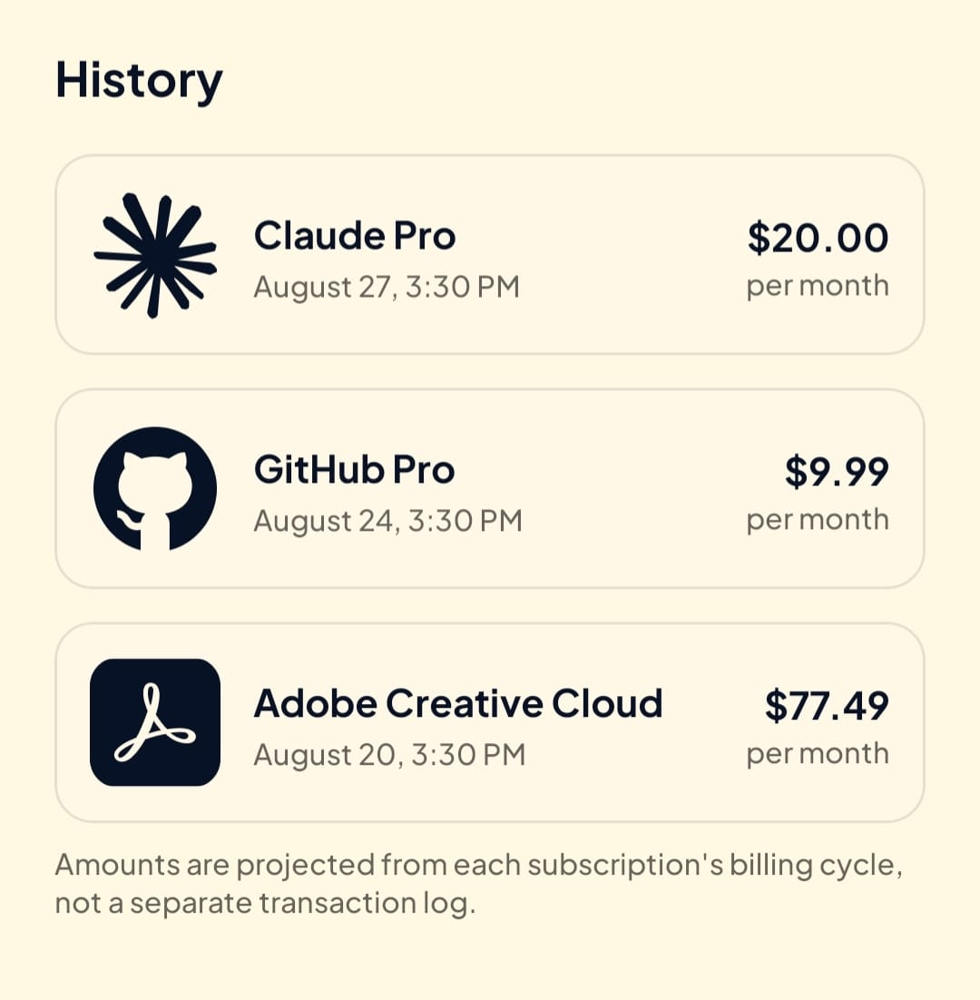
</div>

<p align="center"><b>History</b><br/><sub>A chronological log of billing events, projected from each subscription's billing cycle.</sub></p>

<br/>

### ⚙️ Settings & Personalization

<table>
<tr>
<td align="center" width="33%">
<br/>
<b>Profile & Appearance</b><br/>
<sub>Account profile card plus the Theme selector (Light / Dark / System).</sub>
</td>
<td align="center" width="33%">
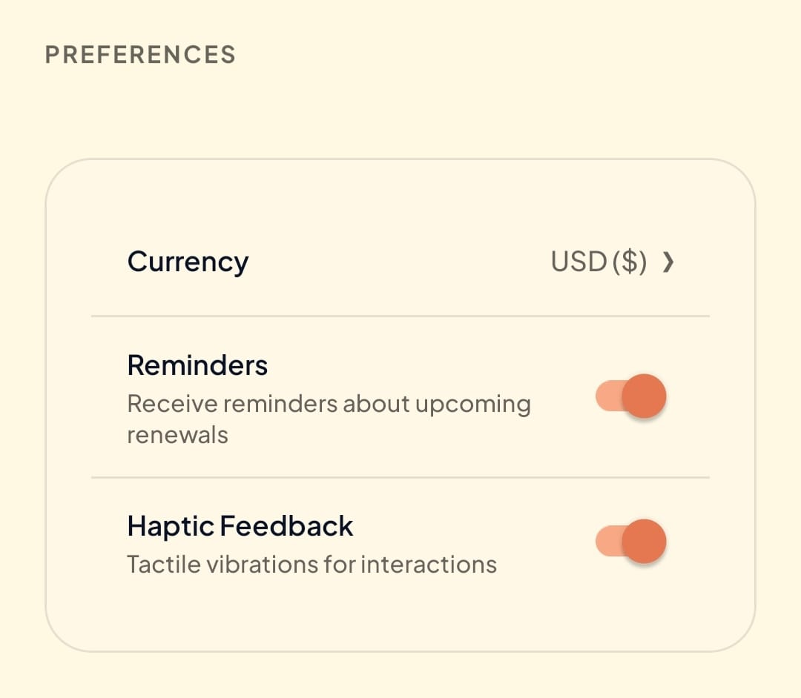<br/>
<b>Preferences</b><br/>
<sub>Currency selector and toggles for renewal reminders and haptic feedback.</sub>
</td>
<td align="center" width="33%">
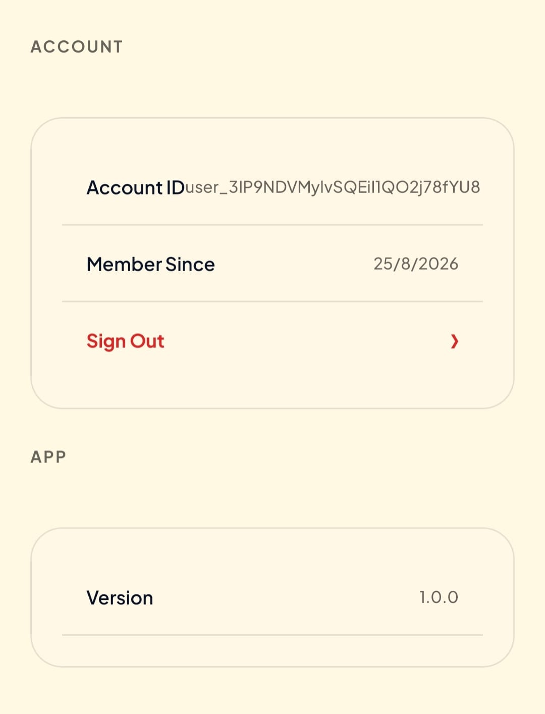<br/>
<b>Account & App Info</b><br/>
<sub>Account ID, member-since date, sign-out, and current app version.</sub>
</td>
</tr>
</table>

<p align="center"><b>Make Recurrly Yours</b><br/><sub>Every preference shown here is persisted securely on-device via <code>expo-secure-store</code>.</sub></p>

---

## 📋 Screens at a Glance

| Screen | What it does |
|---|---|
| 🌟 **Welcome** | First-launch screen for signed-out users, introducing the app and routing into Sign In / Create Account |
| 🔑 **Authentication** | Sign in, sign up with email verification, and password recovery — all powered by Clerk |
| 🏠 **Home / Dashboard** | Monthly spend hero card, quick actions, spending overview, and recent activity feed |
| 💳 **Subscriptions** | Full searchable list of subscriptions with color-coded cards |
| 📊 **Insights** | Month switcher, spending overview, category donut chart, 6-month trend, financial health score, smart insights, and history |
| ⚙️ **Settings** | Theme selection, currency, notifications & haptics preferences, account info, sign-out |

---

## 🛠️ Tech Stack

<table>
<tr><td><b>📱 Mobile Framework</b></td><td>

React Native `0.81` · Expo SDK `54` · Expo Router `6` (file-based, typed routes) · React `19`

</td></tr>
<tr><td><b>🔐 Authentication</b></td><td>

Clerk (`@clerk/expo`) · `expo-secure-store` for encrypted token & preference persistence

</td></tr>
<tr><td><b>🎨 Styling & UI</b></td><td>

NativeWind `5` (Tailwind CSS for React Native) · Tailwind CSS `4` · Custom Plus Jakarta Sans font family · `react-native-reanimated` & `react-native-worklets`

</td></tr>
<tr><td><b>📦 State Management</b></td><td>

Zustand for lightweight, hook-based subscription state

</td></tr>
<tr><td><b>📊 Data & Visualization</b></td><td>

Hand-built SVG charts (`react-native-svg`) · `dayjs` for date/billing calculations · a custom billing-ledger + insights aggregation engine

</td></tr>
<tr><td><b>📈 Analytics</b></td><td>

PostHog (`posthog-react-native`) — session identification, feature events, and app lifecycle tracking

</td></tr>
<tr><td><b>☁️ Deployment / Build</b></td><td>

EAS Build (Expo Application Services) — internal APK distribution for Android

</td></tr>
</table>

---

## 🏗️ Architecture

Recurrly is a **client-first mobile application**. There is no custom backend server — authentication is delegated to Clerk as an auth-as-a-service provider, product analytics is delegated to PostHog, and all subscription data, spending calculations, and insights are computed **on-device** from local application state.

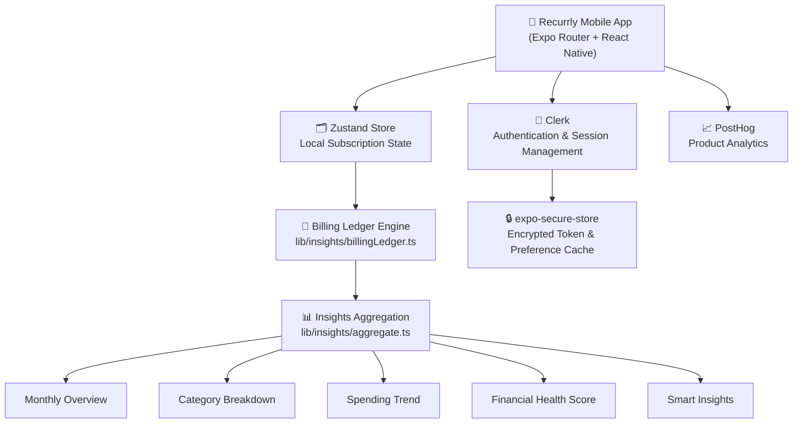

**How it fits together:**
1. On launch, `ClerkProvider` restores the user's session using an encrypted token cache.
2. Signed-in users land in the tab navigator; signed-out users are redirected to onboarding.
3. Subscription data lives in a Zustand store, seeded with example data on first load.
4. The **billing ledger** expands each subscription into a timeline of historical and projected billing events.
5. The **aggregation layer** turns that event timeline into everything the Insights screen shows — totals, category splits, trends, health score, and smart insights — entirely client-side.
6. Theme mode and user preferences (currency, haptics, notifications) persist locally via `expo-secure-store`.
7. Key user actions (theme change, currency change, sign-out) are captured as PostHog events.

> ℹ️ Subscription data currently resets to the seeded demo dataset on a fresh install/relaunch — there is no cloud sync or persistent database yet. See [Future Improvements](#️-future-improvements).

---

## 📂 Project Structure

```
Recurrly/
├── app/                      # Expo Router file-based routes
│   ├── (auth)/                # Sign in, sign up, forgot password
│   ├── (tabs)/                 # Home, Subscriptions, Insights, Settings
│   ├── subscriptions/[id].tsx  # Subscription detail route
│   ├── onboarding.tsx           # Pre-auth welcome screen
│   └── _layout.tsx              # Root layout: Clerk, Theme, Fonts, PostHog
│
├── components/                # Reusable UI components
│   ├── auth/                   # Auth form fields & buttons
│   ├── home/                   # Dashboard-specific components
│   └── insights/                # Charts, health score, insight cards
│
├── lib/                       # Application logic (no UI)
│   ├── insights/                # Billing ledger + aggregation engine
│   ├── auth/                     # Clerk token cache & form validation
│   ├── subscriptionStore.ts       # Zustand store
│   └── posthog.ts                  # Analytics client
│
├── context/
│   └── ThemeContext.tsx        # Light / dark / system theme provider
│
├── constants/                 # Design tokens, mock data, icon/image maps
├── assets/                    # Fonts, icons, images
├── app.json / eas.json         # Expo & EAS build configuration
└── global.css                 # NativeWind / Tailwind theme tokens
```

---

## ⚡ Getting Started

### Prerequisites
- Node.js `18+`
- npm
- The [Expo Go](https://expo.dev/go) app, or an Android/iOS simulator
- A free [Clerk](https://clerk.com) account (for authentication)

### 1. Clone the repository
```bash
git clone https://github.com/<your-username>/<your-repo>.git
cd <your-repo>
```

### 2. Install dependencies
```bash
npm install
```

### 3. Configure environment variables
Create a `.env` file in the project root:

```bash
EXPO_PUBLIC_CLERK_PUBLISHABLE_KEY=your_key_here
EXPO_PUBLIC_POSTHOG_PROJECT_TOKEN=your_key_here
EXPO_PUBLIC_POSTHOG_HOST=https://us.i.posthog.com
```

> PostHog is optional — the app runs fine with analytics disabled if no token is provided.

### 4. Run the app
```bash
npx expo start
```

Then choose to open it in:
- **Expo Go** (scan the QR code)
- An **Android emulator** — `npm run android`
- An **iOS simulator** — `npm run ios`

---

## 📲 Install the Android App

<div align="center">

### Try Recurrly on your Android device — no Play Store required.

**[⬇️ Download / Install Recurrly (Android APK)](https://expo.dev/accounts/lakshay_coder/projects/Subscription-tracker/builds/3e15fb52-0b25-424b-a93f-462eff679c30)**

Or scan the QR code below with your Android device's camera:


</div>

> 📌 The build is distributed as an **internal EAS build**. Android may show a warning for apps installed outside the Play Store — this is expected for internal distribution builds; tap **"Install anyway"** to proceed.

**To generate your own QR code for this link:** paste the EAS build URL above into any QR generator (e.g. [qr-code-generator.com](https://www.qr-code-generator.com/)) and save the result as `assets/readme/install-qr.png`.

---

## 🎥 Demo

> 🎬 *A walkthrough video/GIF will be added here.*
>
> Suggested content: onboarding → sign-up → dashboard tour → adding a subscription → insights walkthrough → theme switching.

```
assets/readme/demo.gif
```

---

## 🧠 What I Learned

Building Recurrly was an exercise in shipping a **production-shaped** mobile app end-to-end, not just a UI prototype:

- **File-based navigation** with Expo Router, including route groups (`(auth)`, `(tabs)`) and typed routes
- Integrating a **real third-party auth provider** (Clerk) — sign-up with email verification, sign-in, password recovery, and secure session persistence
- Designing a **theming architecture** from scratch using React Context + CSS variables (via `react-native-css`) that stays in sync with NativeWind
- Building a **data aggregation engine** (billing ledger → monthly overview → category breakdown → trend → health score) entirely in TypeScript, with no backend
- Hand-rolling **animated SVG charts** instead of reaching for a charting library, to control performance and design fidelity
- Wiring up **product analytics** (PostHog) for identification, feature events, and lifecycle tracking
- Producing a distributable **Android build via EAS**, including environment-based configuration for `development`, `preview`, and `production` profiles

---

## 🗺️ Future Improvements

> The following are ideas for future iterations — **not** currently implemented.

- ☁️ Persist subscriptions to a real backend/database (currently local, in-memory demo data)
- 🔔 Real push notifications for upcoming renewals (the current "Reminders" toggle is a saved preference, not yet wired to push delivery)
- 📄 A fully built-out Subscription Details screen (currently a placeholder route)
- 💰 Budget goals and spending limits
- 🌐 Public Play Store / App Store release
- 🔄 Recurring payment automation / bank or card sync

---

## 👨‍💻 Developer

**Lakshay Aggarwal**
Mobile Developer

[](https://github.com/lakshay-aggarwal-codes)
[](https://www.linkedin.com/in/lakshay-aggarwal-44443b336/)

<sub>Update the GitHub/LinkedIn links above with your actual profile URLs.</sub>

---

<div align="center">

## ⭐ Like what you see?

If you found this project interesting, explore the code, try the Android build, or reach out — I'd love to hear your thoughts.

**Built with React Native, Expo, and a lot of attention to detail.**

</div>
